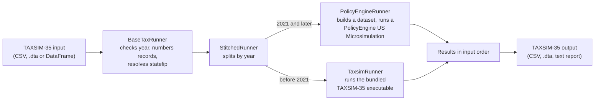

# Design: how the emulator works

This document describes how policyengine-taxsim turns a TAXSIM-35 input file into TAXSIM-35 output: which engine computes each record, how inputs become PolicyEngine US variables, how outputs are assembled, how versions are managed, and where results differ from TAXSIM. It is written for methodologists and reviewers; the [input guide](input-guide.md) covers preparing data, and the [security and deployment notes](security-and-deployment.md) cover installation, dependencies and network use.

Blocks marked as generated are produced from the code by `scripts/generate_docs_reference.py`, and `tests/test_docs_reference.py` fails when they no longer match it. File references are to this repository unless they name another package.

Contents:

- [Components](#components)
- [Routing by year](#routing-by-year)
- [From inputs to PolicyEngine variables](#from-inputs-to-policyengine-variables)
- [Adjustments at run time](#adjustments-at-run-time)
- [Where each output comes from](#where-each-output-comes-from)
- [Records computed by TAXSIM-35](#records-computed-by-taxsim-35)
- [Versions and pinning](#versions-and-pinning)
- [Known differences from TAXSIM-35](#known-differences-from-taxsim-35)
- [Testing](#testing)

## Components



| Part | Code | Role |
|---|---|---|
| Command line | `policyengine_taxsim/cli.py` | The `policyengine-taxsim` command: stdin to stdout like `taxsim35`, plus the `policyengine`, `taxsim`, `compare` and `sample-data` subcommands |
| Runners | `policyengine_taxsim/runners/` | `BaseTaxRunner` (shared checks), `StitchedRunner` (routing), `PolicyEngineRunner`, `TaxsimRunner` (bundled executable), `RemoteTaxsimRunner` (NBER's web service, opt-in) |
| Input and output mapping | `policyengine_taxsim/config/variable_mappings.yaml`, `policyengine_taxsim/core/` | Which PolicyEngine variable each TAXSIM column feeds and each output comes from; state-specific outputs (`state_output_resolver.py`); the text report (`text_formatter.py`) |
| Bundled TAXSIM-35 | `resources/taxsimtest/`, `resources/taxsim35/` | NBER executables, installed with the package |
| Comparison | `policyengine_taxsim/comparison/`, `dashboard/` | Record-by-record comparison of the two engines, and the validation dashboard at policyengine.org/us/taxsim |
| Hosted API | `policyengine_taxsim/api.py` | The service behind the web runner, deployed on Modal; not used by a local install |
| R package | `r-package/policyenginetaxsim/` | Calls `PolicyEngineRunner` through reticulate |

The tax rules themselves live in [policyengine-us](https://github.com/PolicyEngine/policyengine-us), which this package installs as a dependency. The emulator chooses inputs and reads outputs; it does not compute taxes itself.

## Routing by year

`StitchedRunner` (`policyengine_taxsim/runners/stitched_runner.py`) sends each record by its `year`:

- `year` of 2021 or later: `PolicyEngineRunner`. The cutoff is the class constant `PE_MIN_YEAR = 2021`, which callers can change with the `pe_min_year` argument.
- Earlier years: `TaxsimRunner`, which runs the bundled TAXSIM-35 executable on this machine. With `use_remote_taxsim=True` (Python only; no command-line flag sets it), they go instead to `RemoteTaxsimRunner`, which posts them to NBER's TAXSIM-35 web service.

Each engine gets its records in one batch. The results are concatenated and put back in input order by original position, so repeated `taxsimid` values (panels, multi-state runs) keep their order. Options that only PolicyEngine understands (`--disable-salt`, `--assume-w2-wages`, `--logs`, an active S-corporation treatment) are applied to PolicyEngine rows only, with a warning when some records go to TAXSIM-35.

The stdin command and the `policyengine` subcommand use `StitchedRunner`, as does the hosted web runner. `PolicyEngineRunner` used directly (the documented Python entry point) and the R package do not route: they compute every year with PolicyEngine. The `taxsim` subcommand computes every year with TAXSIM-35. The [input guide](input-guide.md#which-engine-computes-each-record) has the full table.

NBER's `taxsim35` Stata command is not part of this package. It sends every record to TAXSIM-35, and the copy NBER served on 2026-10-09 makes no reference to PolicyEngine. No interface switches engines except the ones built on `StitchedRunner`.

## From inputs to PolicyEngine variables

`PolicyEngineRunner` (`policyengine_taxsim/runners/policyengine_runner.py`) computes records with a PolicyEngine US `Microsimulation`. Rather than build one household at a time, it turns a batch of records into a dataset and simulates them together:

1. **Checks.** `BaseTaxRunner` requires a `year` column, numbers the records 1, 2, 3, ... when there is no `taxsimid` column, and converts `statefip` to an SOI `state`. `PolicyEngineRunner` then rejects state codes outside 0 to 51. The [input guide](input-guide.md#what-the-emulator-rejects) lists every check.
2. **Chunks.** Records are grouped by year and split into chunks of at most 10,000 (`CHUNK_SIZE`). Each chunk is simulated separately.
3. **Defaults.** `TaxsimMicrosimDataset._apply_defaults_vectorized` fills missing columns and blank cells (ages 40 for adults and 10 for dependents, `mstat` 1, and so on) and converts TAXSIM-32 dependent counts to ages.
4. **People and units.** Each record becomes one household containing one tax unit, family, SPM unit and marital unit. The household has a primary taxpayer, a spouse when `mstat` is 2, and `depx` dependents. `mstat` 6 sets `is_separated` on the primary taxpayer and `cohabitating_spouses` on the unit, and PolicyEngine US then derives the filing status (separate, or head of household when a qualifying child allows it).
5. **Amounts.** Each TAXSIM column sets one PolicyEngine variable for a particular person. Per-person columns (`pwages`, `swages`, ...) go to that person. Household columns (interest, dividends, capital gains, S corporation income) are split evenly on joint returns. Pensions and Social Security follow an age rule that keeps state retirement exclusions from being lost on a younger spouse. The [input guide](input-guide.md#how-the-emulator-reads-each-column) has the generated table for every column; the mapping itself is `taxsim_to_policyengine` in `variable_mappings.yaml`, with the per-person rules in `TaxsimMicrosimDataset`.
6. **Fixed inputs.** TAXSIM-35 has no inputs for public benefits, use taxes and some state payments, so the dataset sets these on every record regardless of the input file (generated from the dataset built for a minimal record):

<!-- BEGIN GENERATED: fixed-inputs -->
- `ak_energy_relief` = 0
- `ak_permanent_fund_dividend` = 0
- `ca_use_tax` = 0
- `co_child_care_subsidies` = 0
- `commodity_supplemental_food_program` = 0
- `early_head_start` = 0
- `free_school_meals` = 0
- `head_start` = 0
- `id_grocery_credit_qualified_months` = 12
- `il_use_tax` = 0
- `ma_covid_19_essential_employee_premium_pay_program` = 0
- `me_affordability_payment` = 0
- `medical_expense_health_insurance_premiums` = 0
- `nc_use_tax` = 0
- `ok_use_tax` = 0
- `pa_use_tax` = 0
- `reduced_price_school_meals` = 0
- `snap` = 0
- `ssi` = 0
- `tanf` = 0
- `wic` = 0
<!-- END GENERATED: fixed-inputs -->

   The comments in `TaxsimMicrosimDataset._initialize_dataset_structure` and `generate` give each one's reason. For example, `medical_expense_health_insurance_premiums` is zeroed so that PolicyEngine's imputed Medicare premiums don't reach state medical deductions TAXSIM-35 never sees.
7. **Temporary file.** The dataset is written to a temporary HDF5 file, read by the `Microsimulation`, and deleted when the chunk finishes.

States: PolicyEngine always simulates a household in some state. A record with `state` 0 (no state tax) is simulated in Texas, which has no income tax, and reported as state 0. Because TAXSIM-35 files no state return for state 0, it also deducts no state or local income or sales tax, so the emulator zeroes that deduction for state-0 records. A chunk that mixes state-0 and other records is simulated twice, with and without the deduction, and each record takes the matching result.

## Adjustments at run time

After building the `Microsimulation`, `PolicyEngineRunner._build_configured_sim` holds some variables fixed to match TAXSIM-35's assumptions. It uses `_pin_input`, which keeps each value fixed in the marginal-rate calculation too. `tests/test_docs_reference.py` builds a simulation for records that meet every condition and checks that each variable it holds fixed is in this table.

| Variables | When | Why |
|---|---|---|
| `passive_partnership_s_corp_income` | Always | Classifies `scorp` income for the net investment income tax: passive by default (TAXSIM-35's convention) when policyengine-us is 2.10.1 or later, active otherwise or with `--scorp-treatment active` |
| `state_and_local_sales_or_income_tax` | `state` 0, or `--disable-salt` | TAXSIM-35 deducts no state income or sales tax without a state return. `--disable-salt` removes it for every record, to match TAXSIM-35's federal treatment of state tax |
| `w2_wages_from_qualified_business` | `--assume-w2-wages` | Assumes enough W-2 wages that the QBI deduction's wage limit never binds, as TAXSIM-35 does for `pbusinc` |
| `rental_income_would_be_qualified` | Any `otherprop` | TAXSIM-35 gives no QBI deduction on `otherprop`; PolicyEngine would otherwise treat rental income as qualified |
| `mn_renters_credit_qualifying_crp` | Minnesota renters | Assumes the Certificate of Rent Paid that Minnesota's renter's credit requires and TAXSIM-35 inputs can't record |
| `ssi`, `snap`, `tanf`, `wic`, and the state SSI supplements `ca_state_supplement`, `co_state_supplement`, `ma_state_supplement`, `nm_ssi_state_supplement`, `sc_ssi_state_supplement` and `tx_ssi_state_supplement` | Always | Benefits PolicyEngine would otherwise compute; TAXSIM-35 has none, and some count as income in state credits |
| `md_local_income_tax_before_refundable_credits` | Maryland | TAXSIM-35's Maryland `siitax` excludes county income tax |
| `utilities_included_in_rent` | Maine renters | Maine's property tax fairness credit excludes utilities from rent; TAXSIM-35's `rentpaid` is gross rent |
| `ny_additional_ctc`, `ny_inflation_refund_credit`, `ny_supplemental_eitc` | New York | Payments made outside Form IT-201, which TAXSIM-35's `siitax` excludes |

## Where each output comes from

`PolicyEngineRunner._extract_vectorized_results` computes the outputs listed in `policyengine_to_taxsim` in `variable_mappings.yaml`:

- Each record's `idtl` selects its columns: 0 the standard set, 2 and 5 the full set. Cells a record didn't ask for are left blank, and columns no record asked for are dropped.
- Each output is one PolicyEngine US variable, a sum of several, or for state outputs a state-specific variable chosen by the record's state (`policyengine_taxsim/core/state_output_resolver.py`).
- `srebate` is the state tax with one-time state rebates set to 0, minus the actual state tax, computed on a second simulation with those rebates forced to 0. The rebates:

<!-- BEGIN GENERATED: one-time-rebates -->
`az_families_tax_rebate`, `co_tabor_cash_back`, `ct_child_tax_rebate`, `de_relief_rebate`, `ga_surplus_tax_rebate`, `hi_act_115_rebate`, `id_2022_rebate`, `id_special_season_rebate`, `il_income_tax_rebate`, `il_property_tax_rebate`, `in_automatic_refund_rebate`, `ma_taxpayer_refund_rebate`, `me_relief_rebate`, `mt_income_tax_rebate`, `nm_2021_income_rebate`, `nm_additional_2021_income_rebate`, `nm_supplemental_2021_income_rebate`, `or_kicker`, `ri_child_tax_rebate`, `sc_2022_rebate`, `va_rebate`
<!-- END GENERATED: one-time-rebates -->

- `frate` and `srate` raise wages by $100, split between spouses in proportion to their wages, and report the change in federal or state income tax as a percentage. TAXSIM-35 uses a one-cent change in batch mode; PolicyEngine computes in 32-bit floating point, where one cent is too small.
- Amounts are rounded to cents but stored as 32-bit floats, so they can print with extra digits (4009.199951171875 for 4009.20).
- With `idtl` 5, the stdin command writes the full text report (`policyengine_taxsim/core/text_formatter.py`) instead of CSV.

Every output (generated from `variable_mappings.yaml`):

<!-- BEGIN GENERATED: output-sources -->
| Output | TAXSIM-35 description | Computed from | idtl |
|---|---|---|---|
| `taxsimid` | Record ID | The input value | 0, 2, 5 |
| `year` | Year | The input value | 0, 2, 5 |
| `state` | State (SOI code) | The input value | 0, 2, 5 |
| `fiitax` | Federal IIT Liability | `income_tax`. Includes the net investment income tax but not the Additional Medicare Tax, which is in `fica`, `tfica` and `addmed` | 0, 2, 5 |
| `siitax` | State IIT Liability | `state_income_tax` | 0, 2, 5 |
| `fica` | FICA (OADSI and HI, sum of employee AND employer including Additional Medicare Tax) | `taxsim_fica` | 0, 2, 5 |
| `frate` | Federal Marginal Rate | Change in `income_tax` when wages rise by $100, as a percentage | 0, 2, 5 |
| `srate` | State Marginal Rate | Change in `state_income_tax` when wages rise by $100, as a percentage | 0, 2, 5 |
| `ficar` | FICA rate | Not produced on PolicyEngine rows | 0, 2 |
| `tfica` | Taxpayer liability for FICA | `taxsim_tfica` | 0, 2, 5 |
| `v10` | Federal AGI | `adjusted_gross_income` | 2, 5 |
| `v11` | UI in AGI | `tax_unit_taxable_unemployment_compensation` | 2, 5 |
| `v12` | Social Security in AGI | `tax_unit_taxable_social_security` | 2, 5 |
| `v13` | Zero Bracket Amount / Standard Deduction | `standard_deduction` | 2, 5 |
| `v14` | Personal Exemptions | `exemptions` | 2, 5 |
| `v15` | Exemption Phaseout | Not produced on PolicyEngine rows | 2, 5 |
| `v16` | Deduction Phaseout | Not produced on PolicyEngine rows | 2, 5 |
| `v17` | Itemized Deductions in taxable income | `itemized_taxable_income_deductions` | 2, 5 |
| `qbid` | QBI deduction | `qualified_business_income_deduction` | 2, 5 |
| `niit` | Net Investment Income Tax | `net_investment_income_tax` | 2, 5 |
| `addmed` |  | `additional_medicare_tax` | 2 |
| `v18` | Federal Taxable Income | `taxable_income` | 2, 5 |
| `v19` | Federal Regular Tax | `income_tax_main_rates` | 2, 5 |
| `v20` | Exemption Surtax | Not produced on PolicyEngine rows | 2, 5 |
| `v21` | General Tax Credit | Not produced on PolicyEngine rows | 2, 5 |
| `v22` | Child Tax Credit | `ctc_value`. In years when the credit is not fully refundable, capped at `ctc_limiting_tax_liability`, so it reports the non-refundable part | 2, 5 |
| `v23` | Reserved | Not produced on PolicyEngine rows | 2, 5 |
| `v24` | Child Care Credit | `cdcc` | 2, 5 |
| `v25` | Earned Income Credit | `eitc` | 2, 5 |
| `v26` | Income for the Alternative Minimum Tax | `amt_income` | 2, 5 |
| `v27` | AMT Liability after credit for regular tax and other allowed credits | `alternative_minimum_tax` | 2, 5 |
| `v28` | Federal Income Tax Before Credits | `income_tax_main_rates` + `capital_gains_tax` | 2, 5 |
| `v29` | FICA | `taxsim_tfica` | 2, 5 |
| `v30` | State Household Income | Not produced on PolicyEngine rows | 2, 5 |
| `v31` | State Rent Expense (imputation for property tax credit) | Not produced on PolicyEngine rows | 2, 5 |
| `v32` | 32. AGI | A state-specific variable (41 states mapped) | 2, 5 |
| `v33` | 33. Exemptions | Not produced on PolicyEngine rows | 2, 5 |
| `v34` | 34. Standard Deduction | `state_standard_deduction` | 2, 5 |
| `v35` | 35. Itemized Deductions | `state_itemized_deductions` | 2, 5 |
| `v36` | 36. Taxable Income | A state-specific variable (42 states mapped) | 2, 5 |
| `staxbc` | Tax before credits | A state-specific variable (44 states mapped). For Delaware couples who elect to file separately on a combined return, the sum of the two separate taxes | 5 |
| `srebate` | State One-Time Rebate | `state_income_tax` with one-time state rebates set to 0, minus `state_income_tax` | 2, 5 |
| `v41` | State Bracket Rate | Not produced on PolicyEngine rows | 5 |
| `v37` | 37. Property Tax Credit | A state-specific variable (15 states mapped) | 2, 5 |
| `v38` | 38. Child Care Credit | A state-specific variable (27 states mapped) | 2, 5 |
| `v39` | 39. EIC | A state-specific variable (31 states mapped) | 2, 5 |
| `sctc` | Child Tax Credit | `taxsim_sctc` adapter (state-specific rules) | 5 |
| `v40` | 40. Total Credits | `state_non_refundable_credits` + `state_refundable_credits`. Summed with one-time state rebates set to 0; they are reported in `srebate` instead | 2, 5 |
| `v42` | 42. Earned Self-Employment Income for FICA | Always 0 on PolicyEngine rows | 2, 5 |
| `v43` | Medicare Tax on Unearned Income | Always 0 on PolicyEngine rows | 2, 5 |
| `v44` | 44. Medicare Tax on Earnings | `employee_medicare_tax` + `additional_medicare_tax` | 2 |
| `actc` | Refundable Part of CTC | `refundable_ctc` | 2, 5 |
| `cares` | Cares Recovery Rebates | `recovery_rebate_credit` | 2, 5 |
<!-- END GENERATED: output-sources -->

## Records computed by TAXSIM-35

`TaxsimRunner` (`policyengine_taxsim/runners/taxsim_runner.py`) handles records before 2021:

1. Picks the bundled executable for the operating system: `taxsimtest-osx.exe`, `taxsimtest-linux.exe` or `taxsimtest-windows.exe`. It looks in `resources/taxsimtest/` under the working directory, then in `share/policyengine_taxsim/taxsimtest/` under the Python environment, where the wheel installs it.
2. Writes the records to a temporary CSV file, converting TAXSIM-32 dependent counts to ages, writing blanks as 0, writing a dependent age of 0 as 10, and keeping only the columns TAXSIM-35 accepts (ages up to `age10`).
3. Runs the executable through the shell (`cat input | executable > output` on macOS and Linux, `type` under `cmd.exe` on Windows) and reads its CSV output. It records the build stamp from the output header (for example `cd2026081819`) and prints it with the progress messages.
4. Deletes both temporary files.

The executables are NBER's `taxsimtest` builds of TAXSIM-35. `resources/taxsimtest/README.md` describes how they are updated and checked; the [security notes](security-and-deployment.md#bundled-taxsim-35-executables) list their hashes and platforms.

## Versions and pinning

Three things determine a result: the policyengine-taxsim version (input and output mapping), the policyengine-us version (tax rules), and, for years before 2021, the bundled TAXSIM-35 build.

**policyengine-taxsim.** Versioned in `pyproject.toml`. Each pull request adds a changelog fragment in `changelog.d/`; on merge to `main`, CI raises the version (major, minor or patch, from the fragment type), writes `CHANGELOG.md`, and publishes the release to PyPI.

**policyengine-us.** `pyproject.toml` sets a minimum (`policyengine-us>=1.711.0`) and no maximum, so an install takes the newest release that fits the Python version. policyengine-us releases often (three times on 2026-10-09) and policyengine-us 2.x requires Python 3.11 or later; on Python 3.10 an install stops at 1.783.0, the last release that supports it (July 2026). The [security notes](security-and-deployment.md#python-versions) show which release each Python version gets.

A new policyengine-us release can change results for any year, including past years, because fixes apply to every year a rule covers. To reproduce results:

1. **Pin both packages**, for example `pip install policyengine-taxsim==3.1.1 policyengine-us==2.38.0`.
2. **Record the versions** with every set of results:
   ```python
   from importlib.metadata import version

   for package in ("policyengine-taxsim", "policyengine-us", "policyengine-core"):
       print(package, version(package))
   ```
   In R, `policyengine_versions()` prints the same. For pre-2021 records, the progress message names the TAXSIM-35 build. [#1412](https://github.com/PolicyEngine/policyengine-taxsim/pull/1412) proposes a `--version` flag and a provenance file written with each run.
3. **Keep a copy of the packages.** PyPI does not keep every release. On 2026-10-09 the oldest policyengine-us release still on PyPI was 1.691.1, uploaded 2026-05-12, and the oldest policyengine-taxsim release was 2.10.0, uploaded 2026-02-26. Earlier releases can no longer be installed by version number, and policyengine-us has no git tags for most releases either. Download the exact files you run (`pip download`) and keep them with your results; the [security notes](security-and-deployment.md#installing-without-internet-access) show how.

**TAXSIM-35 build.** The executables ship inside the policyengine-taxsim package, so pinning policyengine-taxsim pins them too.

## Known differences from TAXSIM-35

Where the emulator knowingly differs from TAXSIM-35, as documented in this repository. The validation dashboard at [policyengine.org/us/taxsim](https://policyengine.org/us/taxsim) measures agreement record by record, and the [issue tracker](https://github.com/PolicyEngine/policyengine-taxsim/issues) records each investigated difference, many of which turned out to be TAXSIM errors.

Inputs:

- `nonprop` is ignored on PolicyEngine rows ([#1245](https://github.com/PolicyEngine/policyengine-taxsim/pull/1245) proposes mapping it).
- `mstat` 8, a dependent filing their own return, is computed as an ordinary unmarried filer ([#1218](https://github.com/PolicyEngine/policyengine-taxsim/pull/1218) proposes support).
- Spouse columns on a non-joint return are ignored; TAXSIM-35 rejects them.
- `state` -1 (compute every state) is not supported.
- PolicyEngine rows accept an 11th dependent age (`age11`); TAXSIM-35 accepts 10.
- Benefits, use taxes and the other fixed inputs above are zero, as TAXSIM-35 has no inputs for them.

Calculations:

- **Additional Medicare Tax.** `fiitax` excludes it and `tfica`, `fica` and `addmed` include it, following TAXSIM's author on [#416](https://github.com/PolicyEngine/policyengine-taxsim/issues/416) and [#1225](https://github.com/PolicyEngine/policyengine-taxsim/issues/1225). The bundled TAXSIM-35 build (cd2026081819) still adds it to `fiitax` for 2013 to 2023, so pre-2021 rows owing it carry it in `fiitax`. See the README.
- **State income tax as a federal deduction.** By default PolicyEngine deducts the state income tax it computes, as the law allows. The `PolicyEngineRunner.run` docstring records that the bundled TAXSIM-35 build deducted mortgage interest and property tax but not state income tax in the states and years checked; `--disable-salt` removes the state income tax deduction to match.
- **One-time state rebates.** PolicyEngine counts them in the tax year they are based on. TAXSIM-35 by default counts them in the year they are paid; its option 30 (`--taxsim-opt30` in `compare`) uses PolicyEngine's convention. `srebate` reports the amount either way.
- **Maryland.** `siitax` excludes county income tax, as TAXSIM-35's does.
- **New York.** `siitax` excludes the payments made outside Form IT-201.
- **Itemized deductions.** `mortgage` and `otheritem` are treated alike; in some states and years TAXSIM-35 leaves `otheritem` out of the state itemized deduction. See the README.
- **S corporation income and the net investment income tax.** Passive by default with policyengine-us 2.10.1 or later; see `--scorp-treatment` in the README.
- **Married filing separately.** `tests/test_married_filing_separately.py` documents the separate-return cases where the bundled TAXSIM-35 build and the emulator differ and the emulator deliberately does not copy TAXSIM-35.
- **Marginal rates.** A $100 wage change instead of one cent; see above.
- **Outputs not produced.** Outputs marked "Not produced" in the table above are absent on PolicyEngine rows, and `v42` and `v43` are always 0.

## Testing

- `tests/` runs on every pull request on Linux, macOS and Windows with Python 3.10 and 3.11 (`.github/workflows/ci.yml`).
- `tests/test_public_contract.py` and `tests/test_cli_entry_point.py` pin the public surfaces: the `policyengine-taxsim` command, the `policyengine_taxsim.runners` import path, and `PolicyEngineRunner(df).run()`.
- `tests/test_docs_reference.py` regenerates every generated block in these documents and fails if one is out of date. `tests/test_input_guide_claims.py` checks the input guide's lists of rejected and unchecked values. `tests/test_worked_example.py` runs the worked example. `tests/test_no_network.py` runs the emulator with every network connection refused.
- Many tests check the emulator against output from the bundled TAXSIM-35 executable; the [comparison dashboard](https://policyengine.org/us/taxsim) runs the full comparison for each year from 2021.
